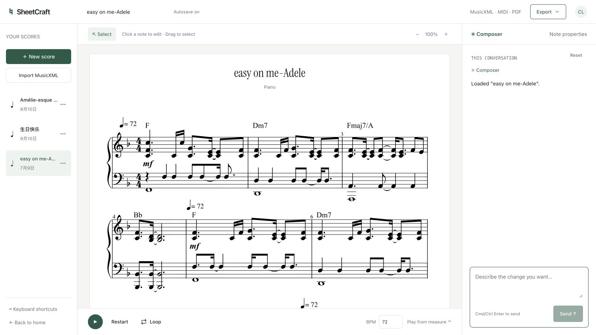

# SheetCraft

SheetCraft is an open-source sheet music editor. It can generate a score from a text prompt, edit notes with a conversational composer, render MusicXML, play the score, and export MusicXML, MIDI, or PDF.



The app uses React, TypeScript, Vite, Hono, and Cloudflare Workers. It stores account and project metadata in D1 and scores in R2. AI generation uses the DeepSeek API by default; without an API key, local development uses a limited fallback planner.

## Run locally

Requires Node.js 22.13+ and npm.

```bash
npm ci
cp .dev.vars.example .dev.vars
```

Set `LLM_API_KEY` in `.dev.vars` if you want model-based generation. Generate a random `BETTER_AUTH_SECRET` with `openssl rand -base64 32`. The `.dev.vars` file is ignored by Git.


In two terminals:

```bash
npm run dev:worker
npm run dev
```

Open `http://localhost:5173`. Apply the local D1 schema once:

```bash
npm run db:migrate
```

You can import `public/sample.musicxml` to try the editor.

## Deploy on Cloudflare

1. Create your own D1 database and R2 bucket, then update the names and D1 ID in `wrangler.toml`.
2. Apply the migrations: `npx wrangler d1 migrations apply sheet_music_db --remote`.
3. Add secrets with `npx wrangler secret put LLM_API_KEY` and `npx wrangler secret put BETTER_AUTH_SECRET`.
4. Run `npm run build`, then `npm run deploy`.

Do not commit API keys, auth secrets, `.dev.vars`, or local `.wrangler` data.

## Checks

```bash
npm test
npm run build
```

The tests cover score parsing and editing, save conflicts, streaming, and MIDI export. This is a MusicXML subset; timewise scores, grace notes, and mid-measure attribute changes are not supported.
GitHub Actions runs these checks and a dependency audit on each push and pull request.

## License

MIT. The bundled Instrument Serif font has its own SIL Open Font License in `public/fonts/instrument-serif-OFL.txt`.
